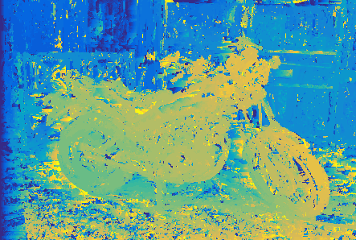

# Stereo Correspondence Project

Stereo Correspondence using three methods:
1. Naive window matching
2. Dynamic Programming Alignment
3. Energy Minimization via Graph Cuts

       
       

youtube link here

## Dependencies
* Python 3
* cv2
* numpy
* PyMaxflow

## Usage
I tried to make main.py similarly structured to our homeworks. To run a single method, comment out lines from main
```
python3 main.py
```

## References
1. G. Myer, "A Fast Bit-Vector Algorithm for Approximate String," University of Arizona Tucson, 1998. 
2. V. Kolmogorov, P. Monasse and P. Tan, "Kolmogorov and Zabih's Graph Cuts Stereo Matching Algorithm," Image Processing On Line, vol. 4, pp. 220-251, 2014. 
3. S. Needleman and C. Wunsch, "A general method applicable to the search for similarities in the amino acid sequence of two proteins," Journal of Molecular Biology, vol. 48, no. 3, pp. 443-453, 1970. 
4. T. F. Smith and M. S. Waterman, "Identification of common molecular subsequences," Journal of Molecular Biology, vol. 147, no. 1, pp. 195-197, 1981. 
5. P. Sellers, "On the Theory and Computation of Evolutionary Distances," Society for Industrial and Applied Mathematics, vol. 26, no. 4, pp. 787-793, 1973. 
6. D. Scharstein, R. Szeliski and H. Hirschmüller, "Middlebury Stereo Vision," [Online]. Available: http://vision.middlebury.edu/stereo/data/.
7. J. L. Blanco, "Mobile Robot Programming Toolkit," [Online]. Available: https://www.mrpt.org/Karlsruhe_Dataset_Rawlog_Format.
