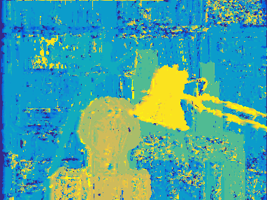
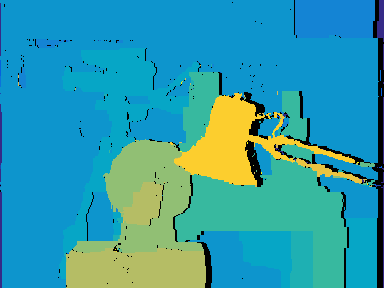

# Stereo Correspondence Project

Stereo Correspondence using three methods:
1. Naive window matching
2. Dynamic Programming Alignment
3. Energy Minimization via Graph Cuts

|    |   |
|   |   |

youtube link here

## Dependencies
* cv2
* numpy
* PyMaxflow

## Usage
I tried to make main.py similarly structured to our homeworks. To single out a method, comment out lines from main
```
python3 main.py
```
